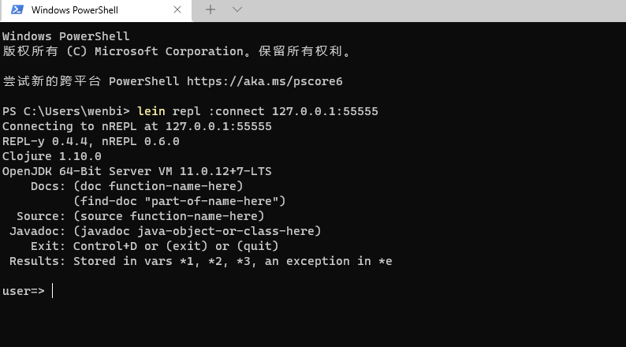
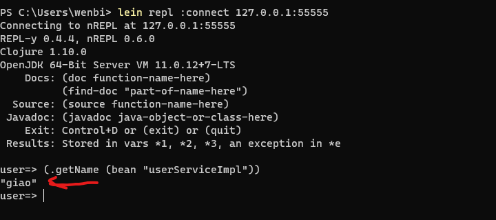
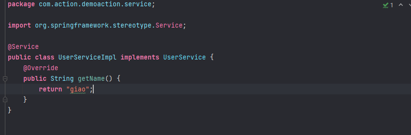

# wbrepl-spring-boot-starter

远程调试springboot-web应用

该项目将nrepl服务内置到你的springboot工程中，然后你可通过连接nrepl服务来调试你的springboot工程，试想生产环境出现了问题，你想调试生产环境正在运行中的代码，用这个就太方便啦

使用该工具调试程序需要你具备一点 __[clojure](https://clojure.org/index)__ 语言能力

## 如何使用

### 添加依赖

* 方式一：直接在pom添加发布在中央仓库的依赖或者
  __[手动下载jar包](https://repo1.maven.org/maven2/io/github/dododcdc/wbrepl-spring-boot-starter/1.0.0/)__
  ```xml

    <dependency>
          <groupId>com.wbrepl</groupId>
          <artifactId>wbrepl-spring-boot-starter</artifactId>
          <version>1.0.0</version>
    </dependency>

  ```
* 方式二：下载本项目，自己install到本地仓库
    * `git clone git@github.com:dododcdc/wbrepl-spring-boot-starter.git`
    * `mvn clean install -Dmaven.test.skip=true`
    * 在你自己的springboot工程中pom.xml引入依赖
  ```xml
  <dependency>
          <groupId>com.wbrepl</groupId>
          <artifactId>wbrepl-spring-boot-starter</artifactId>
          <version>1.0.0</version>
  </dependency>
  ```

### 配置文件
 打开你的工程配置文件application.yml或者application.properties(懂得自然懂)
   * 情况一：本地调试
  
     本地启动springboot工程，application.properties示例
     
     ```properties
        wbrepl.host=127.0.0.1
        wbrepl.port=55555
        wbrepl.enabled=true
     ```
     
   * 情况二：远程调试

       例如：将你的springboot工程打包到172.16.20.44运行，然后你在本地去调试它，application.properties示例

        ```properties
            wbrepl.host=172.16.20.44
            wbrepl.port=55555
            wbrepl.enabled=true
        ```

      

> 提示：配置文件端口不要冲突，wbrepl.enabled一定要设置为true，设置为false时nrepl服务不会启动

### 启动你的springboot工程 
* 本地启动你的工程(配置文件请采用 [ 情况一 ] )
   
  直接用idea启动，或者你打成jar包在本地启动都可以(懂得都懂)

* 将你的工程部署到远程服务器(配置文件请采用 [ 情况二 ])
  
  例如：部署到172.16.20.44服务器运行

### 安装客户端并连接接nrepl服务

* 安装 __[leiningen](https://leiningen.org/)__ 
  * windows 
    
    * 参考官网  __[leiningen](https://leiningen.org/)__ 安装

    * 使用 __[chocolatey](https://chocolatey.org/install)__ 安装 ```choco install lein```

  * linux

    参考官网 __[leiningen](https://leiningen.org/)__  安装 
  
  > 提示：建议使用`choco install lein`傻瓜式安装,安装lein会同时帮你安装openjdk如果你已经配置了java环境可以在安装过程中根据提示不安装openjdk，看不懂提示就一直y确认，把openjdk也装上

* 连接到你的nrepl服务

    `lein repl :connect host:port` 

  示例：

  * 如果你是本地启动的springboot工程：`lein repl :connect 127.0.0.1:55555`
  * 如果你是将springboot工程部署到远程服务器：`lein repl :connect 172.16.20.44:55555`
 
  > 注意：host和port一定要和你的配置文件相同

连接成功后会如下图



调用一个bean的方法试试



可以看到已经返回阿giao的名字 "giao"，userServiceImpl是我的springboot工程中的bean，你可以替换为你自己工程中的bean名称

测试中使用的bean如下图



### 开始调试
`(list-beans)` 获取spring容器中所有的bean

`(bean "userServiceImpl")` 获取名称为userServiceimpl的bean 

`(.getName (bean "userServiceImpl))` 调用userServiceimpl的getName方法

`(.getMsg (bean "userServiceImpl) "tom" "男")` 调用userServiceimpl的getMsg方法

`(find-bean "user")` 查找名字含有user的bean 

`(members (bean "userServiceImpl"))` 查看userServiceImpl这个bean的所有公共成员和方法

你可能会问：就这么几个方法吗？ 我要给一个bean的方法传java实体类参数怎么做？我要获取ApplicationContext怎么做？我想new一个java实例怎么做呢？

请先参考：__[java和clojure交操作](https://clojure.org/reference/java_interop)__ 获取一点灵感

### 结束
本工程实现参考文章：

__[https://engineering.telia.no/blog/java-troubleshooting-on-steroids-with-clojure-repl](https://engineering.telia.no/blog/java-troubleshooting-on-steroids-with-clojure-repl)__

更漂亮的连接工具请参考：
* __[cursive](https://cursive-ide.com/userguide/repl.html)__ (本人使用的这个，相当nice)

* __[Gorilla REPL](http://gorilla-repl.org/)__

* __[Reveal](https://vlaaad.github.io/reveal/)__

* __[Cognitect REBL](https://docs.datomic.com/cloud/other-tools/REBL.html)__

clojure学习相关地址： 
* __[https://clojure.org/](https://clojure.org/)__
* __[https://clojuredocs.org/](https://clojuredocs.org/)__
* __[https://www.braveclojure.com/clojure-for-the-brave-and-true/](https://www.braveclojure.com/clojure-for-the-brave-and-true/)__ 
* __[https://kimh.github.io/clojure-by-example/#about](https://kimh.github.io/clojure-by-example/#about)__


